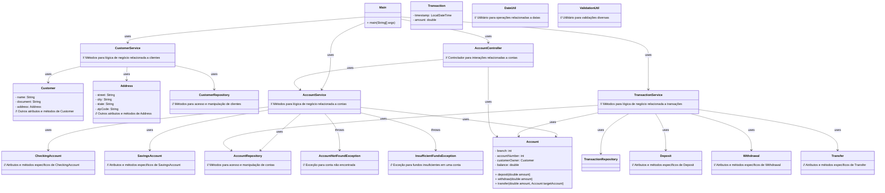

```mermaid
classDiagram
class Main
class Account
class CheckingAccount
class SavingsAccount
class Customer
class Address
class Transaction
class Deposit
class Withdrawal
class Transfer
class AccountRepository
class CustomerRepository
class AccountService
class CustomerService
class TransactionService
class AccountNotFoundException
class InsufficientFundsException
class DateUtil
class ValidationUtil
class AccountController

    Main --> AccountService : uses
    AccountService --> AccountRepository : uses
    AccountService --> Account : uses
    AccountService --> CheckingAccount : uses
    AccountService --> SavingsAccount : uses
    AccountService --> AccountNotFoundException : throws
    AccountService --> InsufficientFundsException : throws

    Main --> CustomerService : uses
    CustomerService --> CustomerRepository : uses
    CustomerService --> Customer : uses
    CustomerService --> Address : uses

    Main --> TransactionService : uses
    TransactionService --> AccountRepository : uses
    TransactionService --> TransactionRepository : uses
    TransactionService --> Account : uses
    TransactionService --> Deposit : uses
    TransactionService --> Withdrawal : uses
    TransactionService --> Transfer : uses

    Main --> AccountController : uses
    AccountController --> AccountService : uses
    AccountController --> Account : uses

    class Main {
        + main(String[] args)
    }

    class Account {
        - branch: int
        - accountNumber: int
        - customerOwner: Customer
        - balance: double
        + deposit(double amount)
        + withdraw(double amount)
        + transfer(double amount, Account targetAccount)
    }

    class CheckingAccount {
        // Atributos e métodos específicos de CheckingAccount
    }

    class SavingsAccount {
        // Atributos e métodos específicos de SavingsAccount
    }

    class Customer {
        - name: String
        - document: String
        - address: Address
        // Outros atributos e métodos de Customer
    }

    class Address {
        - street: String
        - city: String
        - state: String
        - zipCode: String
        // Outros atributos e métodos de Address
    }

    class Transaction {
        - timestamp: LocalDateTime
        - amount: double
    }

    class Deposit {
        // Atributos e métodos específicos de Deposit
    }

    class Withdrawal {
        // Atributos e métodos específicos de Withdrawal
    }

    class Transfer {
        // Atributos e métodos específicos de Transfer
    }

    class AccountRepository {
        // Métodos para acesso e manipulação de contas
    }

    class CustomerRepository {
        // Métodos para acesso e manipulação de clientes
    }

    class AccountService {
        // Métodos para lógica de negócio relacionada a contas
    }

    class CustomerService {
        // Métodos para lógica de negócio relacionada a clientes
    }

    class TransactionService {
        // Métodos para lógica de negócio relacionada a transações
    }

    class AccountNotFoundException {
        // Exceção para conta não encontrada
    }

    class InsufficientFundsException {
        // Exceção para fundos insuficientes em uma conta
    }

    class DateUtil {
        // Utilitário para operações relacionadas a datas
    }

    class ValidationUtil {
        // Utilitário para validações diversas
    }

    class AccountController {
        // Controlador para interações relacionadas a contas
    }
```